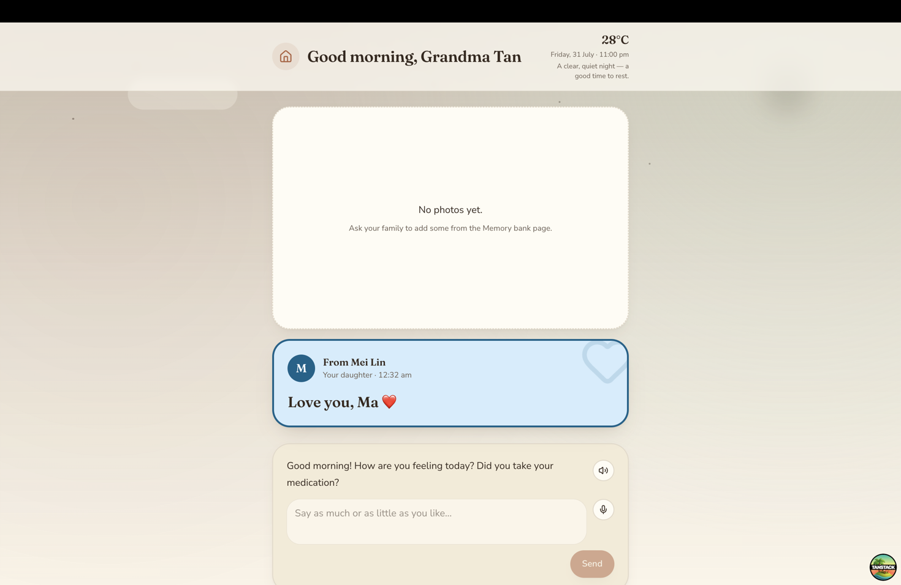
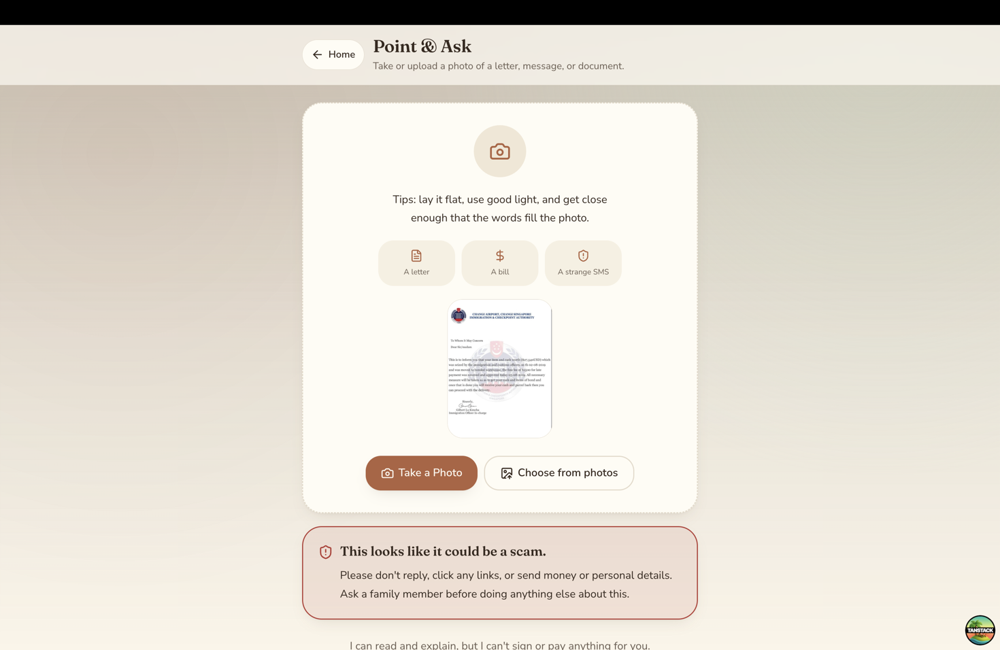
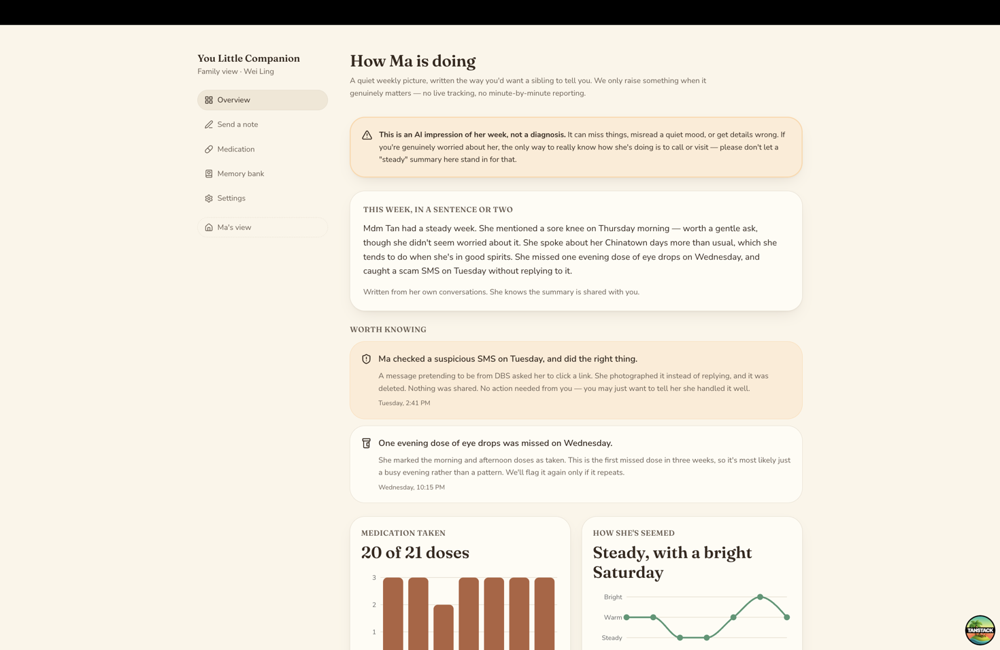

# AI Elderly Companion

An AI companion for elderly users that reduces daily friction around
companionship, medication management, dementia support, and scam
protection, while keeping family involved for anything financial,
health-critical, or requiring human judgment. AI augments family care here;
it never replaces it.

## Overview

The companion checks in daily, gently encourages real contact with family
rather than substituting for it, helps make sense of letters and messages
(flagging likely scams before any harm is done), tracks medication
adherence, and gives family a quiet, non-intrusive view into patterns worth
knowing about, without ever putting that same information in front of the
elder themselves.

The product is built around one constraint: the AI is a bridge to real
relationships, not a replacement for them. There are no engagement-maximizing
mechanics (no streaks, no gamified check-ins): success is measured by real
contact facilitated, not time spent in the app. Anything financially or
medically significant, or anything suggesting sustained distress, is
escalated to family rather than handled by the AI alone.

## Key Features

**Daily check-ins & companionship**: a short daily conversation that adapts
to context: a gentle nudge to reach out to family after a few quiet days, a
warm reminiscence prompt drawn from real memories family has shared, or a
simple how-are-you-feeling check-in. Replies stay natural and unscripted,
while safety-relevant signals (mood, distress, repetition) are tracked
underneath.

**Point & Ask**: photograph a letter, bill, or suspicious message to get a
plain-language explanation, or a clear scam warning if something looks
wrong. Risk is scored from independently extracted signals (urgency, money
requests, authority impersonation, requests for secrecy) rather than left to
a single model judgment call, and a scam detection immediately notifies
family.

**Medication & calendar**: family adds medications and appointments; the
elder sees a simple, always-current view of what's due, what's been taken,
and what's coming up.

**Memory bank & reminiscence**: family shares facts and photos about the
elder's life. The companion draws on these facts (and only these; it never
invents details) to make conversation feel personal and to occasionally
suggest reconnecting with the specific people those memories involve.

**Family dashboard**: a quiet, family-only view of patterns (mood trends,
question-repetition frequency, medication adherence) and any alerts that
need attention, framed as an impression to prompt a real check-in, not a
diagnosis to rely on.

**Multi-language support**: fully localized across English, Mandarin
Chinese, Malay, and Tamil for every elder-facing screen, not just chat
content. Set by family on the elder's behalf, since navigating an
English-only settings menu isn't a realistic ask for someone who doesn't
read English well.

## Screenshots

### Home and daily check-in

The elder's landing screen: a photo from the memory bank, a note from
family, and the day's opening question.



### Point & Ask

A photographed message classified as a scam, with the warning written in
plain language and no action the elder can take alone.



### Family dashboard

The family-only view: a weekly summary in the companion's voice, then
what's worth knowing, adherence, and mood.



## Architecture

Two frontends share one Python backend and one SQLite database, so
product logic is never duplicated:

- **Backend**: Python, SQLite, and the Anthropic Claude API (a faster model
  for classification/tagging decisions, a stronger model for conversational
  replies and explanations). Safety-relevant decisions (scam risk, escalation
  triggers) are computed deterministically from model-extracted signals
  rather than left to a single generative judgment call.
- **Streamlit app**: the original reference implementation, a role selector
  switching between a seeded elder and family view.
- **React app**: a more polished frontend (TanStack Start, React 19,
  Tailwind), backed by a thin FastAPI layer that reuses the same backend
  directly.

See `docs/ARCHITECTURE.md` for the full database schema and key
architectural decisions.

## Getting Started

### Streamlit app

```bash
uv sync
cp .streamlit/secrets.toml.example .streamlit/secrets.toml   # fill in ANTHROPIC_API_KEY
uv run streamlit run app.py
```

### React app

```bash
# Terminal 1: API
uv sync
uv run uvicorn api.main:app --port 8000

# Terminal 2: frontend
cd web
bun install
bun run dev
```

Then open `http://localhost:3000`.

Both apps read from the same local SQLite database and seed a demo elder
and family profile automatically on first run, with no account or manual
setup required.

## Testing & Evaluation

```bash
uv run pytest              # unit + API tests
uv run ruff check .         # lint
uv run ruff format .        # format
```

A separate labeled evaluation set (`eval/`) checks the AI features against
known-answer cases: classification accuracy where there's a single correct
answer, and an LLM-as-judge pass/fail check for free-form replies where
there isn't.

## Project Structure

```
ai-elderly-companion/
├── app.py, pages/       # Streamlit app
├── api/, web/           # FastAPI + React app
├── backend/             # Shared business logic (both frontends)
├── eval/, notebooks/    # Evaluation sets and prompt exploration
├── tests/               # Unit and API tests
└── sql/                 # Database schema
```

## Further Reading

- `docs/ARCHITECTURE.md`: full database schema and key architectural decisions
- `docs/DESIGN_PRINCIPLES.md`: the pillars, escalation rules, and ethical stance in full
- `SECURITY.md`: known limitations and how to report a concern

## Roadmap

This project is under active development. See `ROADMAP.md` for planned work.
